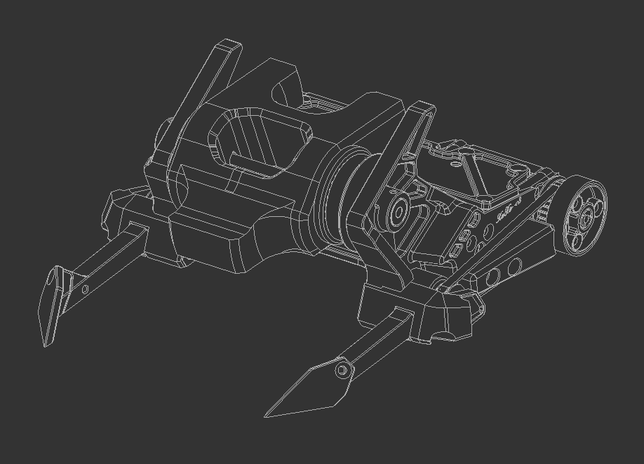
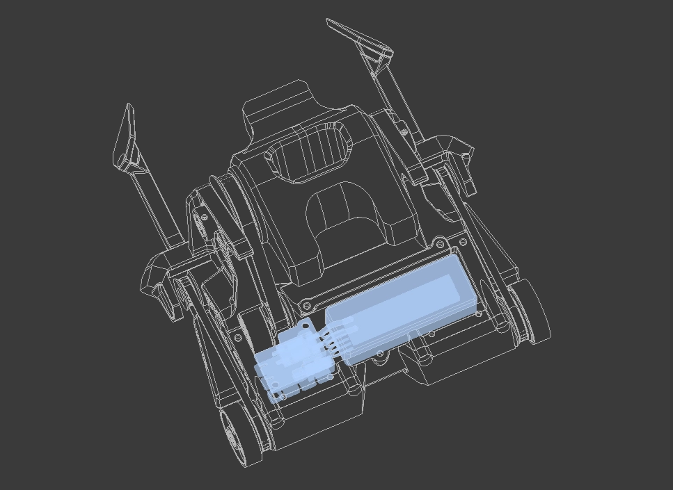

# Mambo - 1lb Combat Robot, Custom ESC Layout

A 1lb plastic (plantweight) vertical spinner combat robot. I thought I'd finally try building a "meta archetype" robot after giving myself a fundamental handicap for my other 1lb combat robot projects. For the motor controller on the weapon system, there's a notable gap in the current capacities for well-known AM32-firmware BLDC motor controllers (above 35A). I also wanted to try out some alternate ESC architectures, the key features are listed below:

**Key system features:** STSPIN32F0ATR BLDC-control specific MCU (eliminates need for standalone gate driver IC), IAUC60N04S6L030H half-bridge IC for lower internal resistance, built-in TVS diodes and bulk capacitance, stable 8V 7.5A-capable output for brushed motor drivers, tight packaging and shock resistant mounting

I didn't bother making a dual brushed motor ESC for the drive system because there were already commercially-available boards that fit within my packaging constraints. Feel free to check out the corresponding technical blog [here](https://future-wool-0d5.notion.site/Mambo-1lb-Combat-Robot-375e4d628bf38082a3adc446fecd4852?pvs=74) :)

---